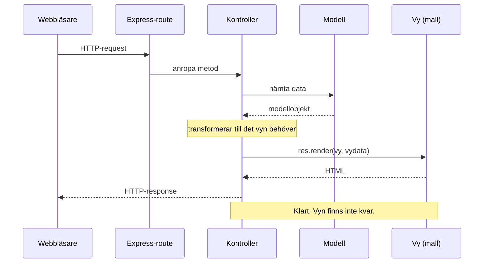
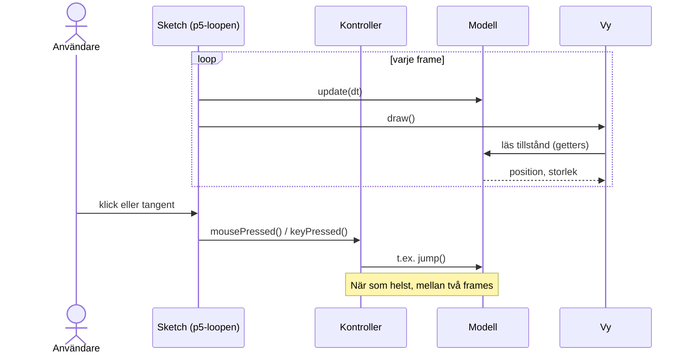

# Reflektioner efter andra sessionen

Den här texten handlar egentligen mindre om MVC i sig och mer om kommunikation kring kod. Modell, vy och kontroller är delade begrepp, men de kan tolkas olika beroende på vilken bakgrund man har, och just den sortens dolda missförstånd gör kod svår att förstå och underhålla tillsammans med andra. Det är därför texten hör hemma i en kurs om mjukvarukvalitet: tydlig kommunikation genom namn, struktur och delade begrepp är en kvalitetsegenskap i sig, inte bara ett stilval.

## MVC i två miljöer: från request/response till spelloop

I tidigare kurser har MVC använts i SSR-applikationer (server-side rendered) byggda med Express.js, med kontroller- och modellklasser och vyer i form av mallar som renderats till HTML. I den här kursen används samma tre roller i ett spel som byggs med p5.js. Rollerna heter likadant och har samma ansvar, men de samverkar på ett annat sätt, eftersom flödet styrs av en loop i stället för av requests. Den här texten förklarar vad som är detsamma, vad som skiljer sig och varför.

Olika bakgrunder ger olika sätt att tillämpa samma begrepp. Den som är van vid MVC i SSR-applikationer och den som är van vid MVC i spelutveckling utgår från helt olika grundläggande krav, request/response respektive en kontinuerlig loop. Därför kan missförstånd uppstå när samma ord, modell, vy, kontroller, förutsätts betyda samma sak i praktiken.

### Varför ett spel?

Webbapplikationer byggs både med SSR och som klienter som lever länge i webbläsaren, med eget tillstånd, händelser och omritning. Ett spel i p5.js är ett tydligt exempel på det senare. Att se samma principer under andra krav gör det lättare att skilja principen från det som är specifikt för HTTP och request/response.

### Vad som är detsamma

- **Modellen** innehåller data och regler och känner inte till hur den visas. I spelet arbetar den i världskoordinater och vet inget om pixlar eller p5.
- **Vyn** ansvarar för presentationen, alltså att rita.
- **Kontrollern** tar emot input utifrån och översätter den till anrop på modellen.
- **Beroenden pekar åt ett håll:** modellen behöver aldrig veta att vyn finns.

### Vad som skiljer sig

#### Flödet: request eller loop

I en Express-app kommer en request in till en route, som anropar en metod i kontrollerklassen. Kontrollern hämtar data från modellen, transformerar den till det vyn behöver och skickar resultatet till vyn med res.render(), och mallen renderas en gång och är sedan klar. I p5.js är det loopen som driver: ramverket anropar `draw()` om och om igen, och vyn läser modellens aktuella tillstånd och ritar det. Kontrollern reagerar på inputhändelser (`mousePressed`, `keyPressed`) vid sidan av. Vyn är mer aktiv än i SSR, men den får fortfarande aldrig ändra spelets tillstånd.

I en Express-app är flödet en kedja: det börjar med en request och är slut när svaret har skickats.



I p5.js går loopen hela tiden. Input kommer in vid sidan av och ändrar modellen via kontrollern, medan vyn bara läser.



Diagrammet visar en tänkt målbild. I koden idag finns varken update(dt) eller någon kontroller, vilket beskrivs nedan.

#### Modellens livslängd

I SSR skapas modellobjekten under en request och försvinner när svaret har skickats, medan tillståndet sparas i en databas. I ett spel lever modellen hela tiden i minnet och förändras även när ingen gör något, till exempel när fiender rör sig eller tiden går. Här behövs en tydlig ansvarsfördelning:

- **p5 äger klockan.** Ramverket vet hur lång tid som gått sedan förra framen (`p.deltaTime`, i millisekunder).
- **Modellen äger reglerna.** Den vet hur tillståndet förändras under en given tid och får den tiden via något i stil med `update(dt)`.

Om modellen får `dt` skickat till sig i stället för att själv läsa `millis()`, går den att testa med exakt de tidssteg som väljs. Tid kan då räknas i världsenheter per sekund i stället för pixlar per frame.

#### Gränsen mellan modell och vy

I SSR hjälper requestens livscykel till. Vyn, alltså mallen, lever bara så länge renderingen tar och försvinner sedan. Den hinner inte hålla kvar referenser till modellen eller ändra den över tid. Det är dock inte nätverket som skiljer modell och vy åt: mallen körs i samma process som modellen och skulle tekniskt sett kunna ändra i den.

I p5.js lever allt i samma minne så länge spelet körs. Ingenting hindrar vyn tekniskt sett från att ändra i modellen, eller modellen från att anropa `circle()`, trots regeln om att det aldrig ska ske. Separationen är därför en konvention som måste hållas manuellt, men språket kan hjälpa till: privata fält med getters (som i `Tomato`) gör modellen skrivskyddad för vyn, vilket gör att data inte behöver kopieras till ett vydataobjekt varje frame, på samma sätt som kontrollern byggde vydata i Express-exemplet ovan.

#### Loopen och koordinatomvandlingen

Två saker saknar tydlig motsvarighet i SSR, och båda behöver en ägare:

- **Loopen.** Sketchen är närmast `app.js` i en Express-app: den skapar objekten och kopplar ihop dem. Skillnaden är att den också driver tiden, som beskrivs ovan under Modellens livslängd.
- **Koordinatomvandlingen.** Världen mäts i tomater med y-axeln uppåt, canvasen i pixlar med y-axeln nedåt. I koden äger `GameView` en `CoordinateConverter` som omvandlar från värld till canvas (`worldToCanvas`) när något ska ritas. När spelet ska ta emot musklick behövs även den omvända riktningen. Omvandlingen är presentationskunskap och hör hemma på gränssnittssidan, aldrig i modellen.

### Koden idag: ett mellanläge

Arkitekturen är inte färdig. Koden växer fram under livekodningen, och nedan visas ett mellanläge där vissa principer redan är på plats och andra inte. En jämförelse med principerna ovan visar vad nästa steg bör vara.

Sketchen i `src/js/index.js`, med JSDoc-kommentarerna borttagna:

```javascript
import p5 from 'p5'
import { GameView } from '@/views/GameView.js'

const sketch = (p) => {
  const TOMATO_CENTER_X = 1
  const TOMATO_CENTER_Y = 0.5
  const TOMATO_DIAMETER = 1

  let gameView
  const tomatoCenterPosition = { x: TOMATO_CENTER_X, y: TOMATO_CENTER_Y }

  p.setup = () => {
    // The GameView is created here to ensure that the p5.js canvas is initialized before the
    // CoordinateConverter is instantiated.
    gameView = new GameView(p)
  }

  p.draw = () => {
    tomatoCenterPosition.x++
    gameView.draw(tomatoCenterPosition, TOMATO_DIAMETER)
  }
}

// Create a new p5 instance and attach it to the 'app' div in the HTML.
new p5(sketch, document.querySelector('#app'))
```

Vyn tar emot `p` och äger både canvasen och koordinatomvandlingen. Utdrag ur `src/js/views/GameView.js`:

```javascript
constructor(p) {
  this.#p = p
  // The p5.js canvas must be initialized before creating the CoordinateConverter.
  p.createCanvas(400, 400)
  this.#coordinateConverter = new CoordinateConverter(p.height)
}

#drawTomato = (centerPositionX, centerPositionY, diameter) => {
  const TOMATO_COLOR = [255, 0, 0]

  const { x, y } = this.#coordinateConverter.worldToCanvas(centerPositionX, centerPositionY)
  const diameterInPixels = diameter * CoordinateConverter.pixelsPerTomato

  this.#p.fill(TOMATO_COLOR)
  this.#p.ellipse(x, y, diameterInPixels, diameterInPixels)
}
```

#### Det som redan är på plats

- **Instance mode.** `p` skickas bara till `GameView`, så ingen annan del av koden kan av misstag anropa p5:s ritfunktioner. Vill en modul nå p5 måste den importera det, och en sådan import syns vid en granskning.
- **Världskoordinater.** Positioner och storlekar anges i tomater. Vyn omvandlar till pixlar via `CoordinateConverter` först när den ritar.
- **En ren modell.** `Tomato` har inget beroende till p5 och exponerar sitt tillstånd via privata fält och getters.

#### Det som återstår att diskutera

- **Modellen används inte ännu.** Tomatens position ligger i sketchen som ett vanligt objekt, `tomatoCenterPosition`, och `Tomato` skapas ingenstans.
- **Sketchen ändrar tillståndet.** `tomatoCenterPosition.x++` i `draw()` flyttar tomaten en hel tomat per frame (i pixlar, enligt `CoordinateConverter.pixelsPerTomato`). Hastigheten beror alltså på bildfrekvensen, och det finns ingen `update(dt)`.
- **Det finns ingen kontroller ännu.** Sketchen hanterar ingen input, och `CoordinateConverter` kan bara omvandla från värld till canvas.
- **Vem ska äga omvandlaren?** I dag skapar `GameView` den. När klick ska översättas till världskoordinater behöver även inputsidan komma åt den. Ska vyn dela med sig av den, eller ska sketchen skapa den och ge den till båda?

### Sammanfattning

MVC finns i flera varianter. Den ursprungliga MVC-modellen från Smalltalk i slutet av 1970-talet hade långlivade vyer som ritades om när modellen ändrades, ungefär som i ett spel. Varianten för webbservrar, ofta kallad Model 2, är en anpassning av samma idé till request/response. Båda är MVC, men med olika flöden.

Rollerna är en ansvarsuppdelning, och hur de samverkar bestäms av kraven: request/response i ena fallet, en loop i det andra. En kontrollfråga som fungerar i båda världarna är:

> Kan modellen köras och testas utan gränssnittet?

Om svaret är ja fungerar separationen, oavsett hur flödet ser ut.
